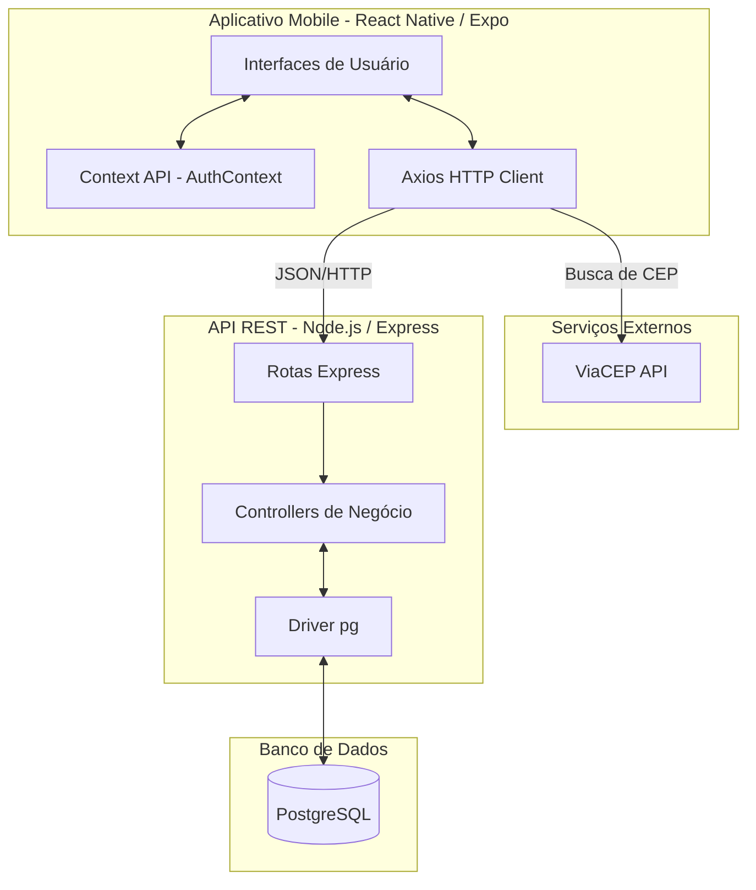
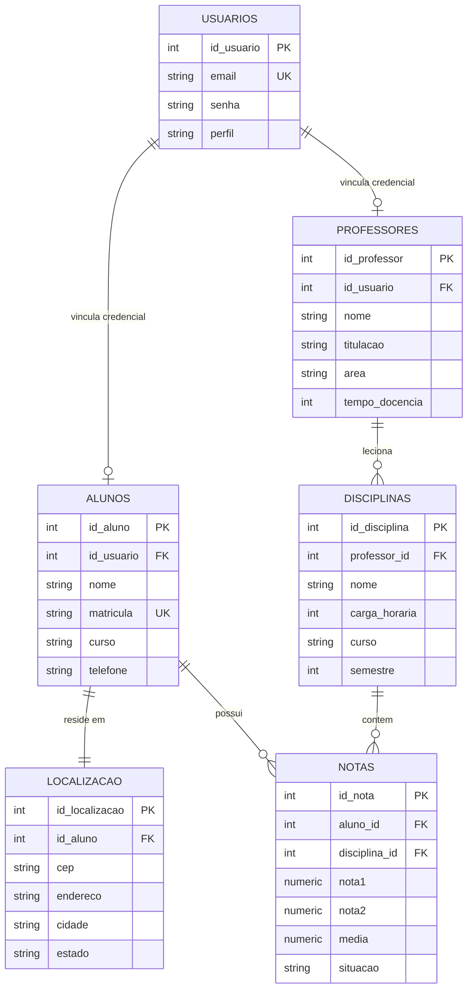

# Documentação Técnica — AppScholar

---

## 1. Visão Geral do Sistema

O **AppScholar** é um sistema de Gestão e Acompanhamento Acadêmico projetado para instituições de ensino. O aplicativo mobile unifica três perfis de usuários em uma única plataforma:

- **Administradores:** Gerenciam cadastros de alunos, professores, disciplinas e realizam a matrícula dos alunos.
- **Professores:** Visualizam suas disciplinas alocadas e realizam o lançamento de notas e faltas.
- **Alunos:** Acompanham seu desempenho acadêmico através da visualização de boletins.

---

### Diagrama de Arquitetura



---

### Stack Tecnológica

| Camada | Tecnologias |
|---|---|
| **Frontend** | React Native (Expo), React Navigation, Axios |
| **Backend** | Node.js (v24+), Express.js, pg (node-postgres), JSON Web Tokens (JWT), bcrypt |
| **Banco de Dados** | PostgreSQL |
| **Integrações** | API ViaCEP (para autocompletar endereços no cadastro) |

---

## 2. Modelagem de Dados

### Diagrama Entidade-Relacionamento



---

### Descrição e Regras de Negócio do Schema

**`usuarios`**
Tabela central de autenticação do sistema. Armazena as credenciais de acesso (email e senha) e restringe o controle de acesso através da coluna `perfil` (`aluno`, `professor`, `admin`).

**`alunos`**
Tabela de dados acadêmicos do discente. Possui relacionamento `UNIQUE 1:1` com a tabela `usuarios`, garantindo que cada credencial pertença a apenas um registro acadêmico. A deleção em cascata (`ON DELETE CASCADE`) vinculada ao usuário simplifica a gestão de registros.

**`localizacao`**
Tabela dedicada a armazenar os dados físicos do aluno (CEP, endereço, cidade e estado). O relacionamento 1:1 isola essas informações, normalizando o schema e melhorando a organização dos dados geográficos. A deleção do aluno apaga automaticamente sua localização.

**`professores`**
Armazena os dados do corpo docente, como titulação acadêmica e tempo de docência. Também está ligada de forma 1:1 com a tabela de credenciais de `usuarios`.

**`disciplinas`**
Representa a grade curricular. A chave estrangeira `professor_id` associa um docente responsável à matéria. Caso o professor seja removido do sistema, o vínculo passa para nulo (`ON DELETE SET NULL`), preservando o histórico da disciplina sem corromper o banco.

**`notas` (Tabela Associativa)**
Resolve a relação N:M entre alunos e disciplinas. Funciona como matrícula ativa e histórico escolar.

> **Constraint Crítica:** O índice `UNIQUE (aluno_id, disciplina_id)` garante que um estudante não possa ser matriculado duas vezes na mesma matéria de forma simultânea.

---

## 3. Backend / API

### Arquitetura

O backend utiliza uma arquitetura **MVC (Model-View-Controller) simplificada**. Não há uma camada pesada de ORM; as queries SQL são escritas cruas no Controller e executadas via `pg` (node-postgres). Essa decisão foi tomada para manter a aplicação leve, permitindo otimizações diretas no PostgreSQL.

| Diretório | Responsabilidade |
|---|---|
| `routes/` | Define os endpoints e mapeia para os métodos do Controller |
| `controllers/` | Contém a lógica de negócio, extração de parâmetros do payload, execução da query e formatação da resposta |
| `database/db.js` | Singleton de conexão com o pool do PostgreSQL |

---

### Endpoints da API

| Método | Rota | Descrição | Payload / Params |
|---|---|---|---|
| `POST` | `/api/auth/login` | Autenticação do usuário | Corpo: `{ email, senha }` |
| `POST` | `/api/alunos` | Cria usuário, aluno e a localização vinculada | Corpo: `{ nome, matricula, email, senha, cep, endereco... }` |
| `GET` | `/api/alunos` | Lista todos os alunos | N/A |
| `GET` | `/api/disciplinas` | Lista disciplinas cadastradas | N/A |
| `POST` | `/api/boletins/matricula` | Matricula aluno (Cria vínculo) | Corpo: `{ aluno_id, disciplina_id }` |
| `PUT` | `/api/boletins/nota/:id_nota` | Atualiza N1/N2 e calcula média | Params: `id_nota`. Corpo: `{ nota1, nota2 }` |
| `GET` | `/api/boletins/:matricula` | Retorna histórico escolar | Params: `matricula` |

---

### Fluxo Crítico: Matrícula de Aluno em Disciplina (`POST /api/boletins/matricula`)

1. **Recepção:** O controller recebe `aluno_id` e `disciplina_id`. Valida a presença de ambos.
2. **Inserção Segura:** Executa `INSERT INTO notas ... ON CONFLICT DO NOTHING`.
3. **Avaliação do Retorno:** Se o `rowCount` for `0`, o banco recusou a inserção devido à constraint `UNIQUE`. O controller intercepta e retorna `HTTP 400` ("O aluno já está matriculado nesta disciplina").
4. **Sucesso:** Caso inserido, retorna `HTTP 201` com os dados do vínculo criado.

---

## 4. Frontend

### Estrutura de Pastas e Responsabilidades

| Diretório | Responsabilidade |
|---|---|
| `src/components/` | Componentes reutilizáveis de UI (`PrimaryButton`, `CustomInput`, `SelectorModal`) |
| `src/screens/` | Views principais acopladas às rotas (`LoginScreen`, `MatriculaAluno`, `AdminDashboard`, etc.) |
| `src/navigation/` | Lógica de roteamento condicional baseada no perfil do usuário (`AppNavigator.js`) |
| `src/hooks/` | Custom hooks, principalmente o `AuthContext.js` para gerenciar o estado global de sessão |
| `src/services/` | Clientes HTTP (`api.js` para o backend próprio e `viacep.js` para busca de endereços integrados no cadastro) |

---

### Gerenciamento de Estado

A aplicação utiliza a **Context API** do React (`AuthContext.js`) para estado global de autenticação.

- **Store:** Contém `user` (objeto com `id`, `email` e `perfil`) e funções expostas (`login`, `logout`).
- **Fluxo de Dados:** Ao realizar o login, o Context salva o token no `AsyncStorage`, injeta o `Bearer token` no interceptor do `api.js` e atualiza o estado `user`. O `AppNavigator.js` escuta a mudança e re-renderiza o stack de navegação apropriado para o perfil retornado.

---

### Fluxo Crítico: Tela de Login e Tratamento de Teclado

1. Usuário digita credenciais em `LoginScreen.js`.
2. Validação inline (Regex de email) impede requisições malformadas.
3. Uso do `onSubmitEditing` foca programaticamente o próximo campo (`senhaRef`).
4. A tela utiliza nativamente o `KeyboardAvoidingView` com `behavior='height'` e preenchimento condicional no `ScrollView` para garantir que o teclado dinâmico do dispositivo não cubra o campo de senha durante a digitação.

---

## 5. Autenticação & Autorização

**Mecanismo:** JSON Web Tokens (JWT).

### Ciclo de Vida

1. Credenciais enviadas a `/api/auth/login`.
2. Controller verifica hash da senha via `bcrypt`. Se válido, assina um JWT contendo o `id_usuario` e `perfil`.
3. Frontend armazena o JWT e o envia no header `Authorization: Bearer <token>` nas rotas protegidas da API.

### Controle de Acesso (RBAC)

Realizado primariamente no frontend pelo `AppNavigator.js`. Se o perfil validado for `admin`, carrega-se o Stack de Administração; se `aluno`, o Stack do Aluno. Middlewares de rotas no backend validam a claim `perfil` extraída do JWT antes de liberar endpoints administrativos de cadastro.

---

## 6. Configuração e Ambiente

### Variáveis de Ambiente (`.env`)

Localizadas na raiz da pasta `backend/`.

```env
PORT=3000
DB_HOST=localhost
DB_PORT=5432
DB_USER=postgres
DB_PASS=sua_senha
DB_NAME=appscholar
JWT_SECRET=sua_chave_secreta_super_segura
```

---

### Como Rodar Localmente

#### Banco de Dados

1. Certifique-se de que o PostgreSQL está ativo.
2. Crie um banco chamado `appscholar`.
3. Execute o script `backend/database/init.sql` para estabelecer a nova estrutura de tabelas relacionais (`usuarios`, `alunos`, `localizacao`, `professores`, `disciplinas`, `notas`).

#### Backend

1. Navegue até a pasta `backend/`.
2. Crie o arquivo `.env` com as configurações do banco.
3. Execute `npm install`.
4. Inicie o servidor com `npm start` (ou `npm run dev` se possuir `nodemon` configurado).

#### Frontend

1. Acesse a pasta `frontend/`.
2. Execute `npm install`.
3. Ajuste a propriedade `baseURL` em `src/services/api.js` para o endereço de IP IPv4 local da sua máquina (ex: `http://192.168.x.x:3000/api`) permitindo a conexão em emuladores móveis ou dispositivos físicos reais.
4. Inicie o projeto Expo via `npx expo start`.

---

## 7. Decisões Técnicas Relevantes e Trade-offs

### Isolamento da Tabela de Localização

A extração do endereço da tabela principal `alunos` para uma tabela dedicada `localizacao` melhora a normalização do banco (3FN), removendo campos grandes não essenciais para a maioria das requisições acadêmicas cotidianas (como a listagem em comboboxes para matrícula).

---

### Matrícula 1:1 e Registros Individuais

O sistema realiza a matrícula do aluno em modelo de dependência direta (`aluno_id` para `disciplina_id`), abandonando matrículas automatizadas em lote.

> **Justificativa:** Apesar de exigir um fluxo com mais passos pelo administrador, este mecanismo previne instabilidades do banco e falhas críticas no lançamento de dependências e flexibilizações de grade de semestres diferentes.

---

### Cálculo Dinâmico vs Armazenamento da Situação

O cálculo final da propriedade `media` e a classificação de `situacao` acadêmica ocorrem integralmente do lado do servidor sempre que a rota `PUT /api/boletins/nota/:id_nota` é ativada.

> **Justificativa:** Mantém o lado cliente leve e não suscetível a manipulações de regras de negócio. Alterações nos critérios de aprovação afetam apenas o controlador correspondente na API REST, sem a exigência de uma nova compilação das interfaces móveis.
